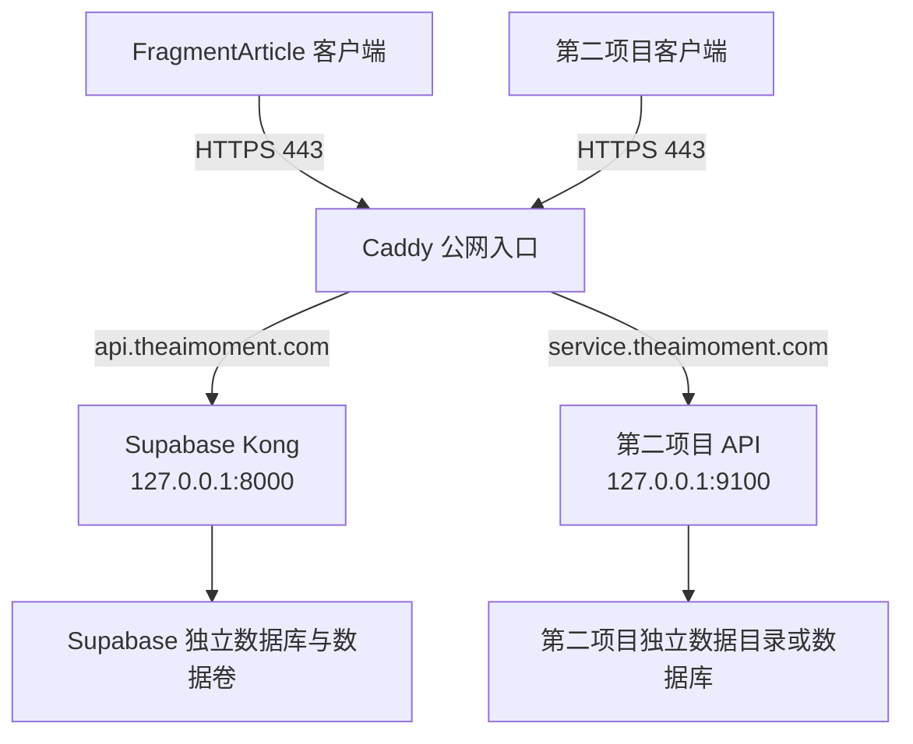

# RackNerd 多项目与子域名接入指南

> 适用场景：在当前 RackNerd VPS 上继续部署一个与 FragmentArticle 无关的后端，并让两个个人项目互不干扰。
>
> 当前基线日期：2026-07-26。

## 1. 先给结论

可以在同一台 VPS、同一个主域名下运行多个项目，并为每个项目分配独立子域名。

当前 Supabase 继续使用：

```text
api.theaimoment.com
```

第二个后端建议使用能表达项目用途的独立子域名，例如：

```text
service.theaimoment.com
notes-api.theaimoment.com
project-name-api.theaimoment.com
```

本文统一用 `service.theaimoment.com` 举例。

不需要购买第二个主域名、第二个公网 IP 或第二张手工管理的证书。DNS 把两个子域名都指向 `107.175.95.166`，Caddy 根据请求中的域名把流量转发到不同的本机端口，并为每个子域名自动申请和续期 HTTPS 证书。

推荐拓扑：



核心规则只有四条：

1. 公网 `80/443` 继续只由 Caddy 占用。
2. 第二项目只把服务发布到回环地址，例如 `127.0.0.1:9100`。
3. 两个项目使用独立目录、Compose 项目名、网络、数据和备份。
4. Caddy 按子域名分流，不要把第二项目塞进 `api.theaimoment.com` 的路径中。

## 2. 当前服务器实际边界

2026-07-26 的只读盘点结果：

| 项目 | 当前状态 |
| --- | --- |
| VPS | RackNerd Ubuntu 24.04 |
| 公网 IP | `107.175.95.166` |
| 内存 | 总计约 `5.8 GiB`，当前可用约 `3.7 GiB` |
| Swap | `3.0 GiB` |
| 根磁盘 | 总计约 `96 GiB`，当前可用约 `75 GiB` |
| Caddy | active，监听公网 `80/443` |
| Docker | active |
| SSH | 公网 `2222`，非 root、公钥登录 |
| UFW | active，默认拒绝未批准的入站端口 |
| Supabase | 8 个批准容器健康 |
| Tailscale | 保留 `8443` 私网回滚入口 |

已占用或保留的宿主机端口：

| 端口 | 绑定地址 | 用途 | 第二项目是否可用 |
| --- | --- | --- | --- |
| `80` | 公网 | Caddy HTTP/ACME | 不可用 |
| `443` | 公网 | Caddy HTTPS/HTTP3 | 不可用 |
| `2222` | 公网 | SSH | 不可用 |
| `8000` | `127.0.0.1` | Supabase Kong | 不可用 |
| `5432` | `127.0.0.1` | Supabase PostgreSQL/Supavisor | 不可用 |
| `6543` | `127.0.0.1` | Supavisor transaction | 不可用 |
| `8443` | Tailscale | Supabase 私网回滚 | 不可用 |
| `9100` | 未监听 | 本文为第二项目预留的示例端口 | 可用，部署前仍需复查 |

以目前资源余量，增加一个轻量 Node.js、Go、Python、.NET API 或带 SQLite 的个人后端通常没有问题。以下类型需要先重新评估资源：

- 自托管大模型或持续运行的推理服务；
- Elasticsearch、OpenSearch、ClickHouse 等重型数据服务；
- 默认占用 1 GiB 以上的 JVM 服务；
- 大量视频转码、图片批处理或浏览器自动化；
- 另起一套完整 Supabase、Kubernetes 或日志平台。

## 3. 为什么使用独立子域名

### 3.1 子域名比路径分流更合适

不建议使用：

```text
api.theaimoment.com/other-project/*
```

当前 `api.theaimoment.com` 是 Supabase 的安全边界，Caddy 只允许：

```text
/auth/v1/*
/rest/v1/*
/functions/v1/*
```

把无关项目加入同一个 Host 会扩大这条安全策略，也会让证书、CORS、Cookie、日志和故障排查互相耦合。

独立子域名的优点：

- Caddy 配置互相独立；
- 一个服务停机不会要求另一个服务改 URL；
- 每个项目可以有不同的请求大小、超时和安全头；
- CORS、Cookie 和认证边界更清楚；
- 后续迁移到另一台服务器时只需要修改该子域名的 DNS。

### 3.2 同一主域名不代表自动共享登录

`api.theaimoment.com` 和 `service.theaimoment.com` 是两个不同 Origin。浏览器不会因为它们属于同一个主域名就自动共享登录状态。

第二项目应当：

- 使用自己的 access token、session 和 API key；
- 使用 Host-only Cookie，不要设置 `Domain=.theaimoment.com`；
- 使用独立 Cookie 名称；
- 精确配置允许的 CORS Origin；
- 不复用 FragmentArticle 的 Supabase `service_role` key 或 JWT secret。

只有在明确设计了单点登录时，才应该让两个项目共享认证。

## 4. 公开子域名还是 Tailscale 私网

两个项目目前都只供个人使用，可以选择两种入口。

### 4.1 推荐：公网子域名加应用层鉴权

适合：

- React Native 或移动设备不想一直运行 Tailscale；
- 需要从任意网络访问；
- 未来可能增加 Web 客户端；
- 需要稳定的普通 HTTPS URL。

使用：

```text
https://service.theaimoment.com
```

注意：子域名公开后，任何人都能尝试连接。必须由应用验证用户 token、session 或强随机 API token。仅仅使用一个不公开宣传的子域名不构成安全措施。

### 4.2 更私密：仅通过 Tailscale

适合：

- 只有自己的 Mac、手机或平板访问；
- 所有设备都可以安装 Tailscale；
- 不需要对互联网公开；
- 后端暂时没有完整鉴权。

这种模式不需要 DNS 子域名，也不需要修改公网 Caddy。可以让 Tailscale Serve 把一个新的 tailnet 端口转发到 `127.0.0.1:9100`。

不要复用 Supabase 已占用的 `8443`，可以选择另一个私网端口，例如 `9443`：

```bash
sudo tailscale serve --https=9443 --bg http://127.0.0.1:9100
tailscale serve status
```

对应访问地址类似：

```text
https://racknerd-b4acd93.tail635b33.ts.net:9443
```

本文后续按“公网子域名加应用层鉴权”展开。

## 5. 推荐的项目隔离方式

### 5.1 目录隔离

建议目录：

```text
/opt/second-backend/
├── app/         # Dockerfile、compose.yaml、应用代码
├── data/        # SQLite、上传文件或其他持久数据
├── backups/     # 本机临时备份，不替代异地备份
└── secrets/     # 服务端密钥，权限 0700/0600
```

当前 Supabase 位于：

```text
/opt/fragment-article/supabase
```

第二项目不要放入 `/opt/fragment-article`，也不要修改 Supabase 的 Compose 网络或容器。

创建目录：

```bash
ssh -p 2222 fragmentops@107.175.95.166

sudo install -d -o fragmentops -g fragmentops -m 0750 \
  /opt/second-backend/app \
  /opt/second-backend/data \
  /opt/second-backend/backups

sudo install -d -o fragmentops -g fragmentops -m 0700 \
  /opt/second-backend/secrets
```

### 5.2 Compose 隔离

第二项目使用固定且唯一的 Compose 项目名：

```text
second-backend
```

不要：

- 使用 `network_mode: host`；
- 使用 `container_name: supabase-*`；
- 加入 Supabase 的 Docker network；
- 把数据库端口发布到公网；
- 在服务器上执行 `docker system prune -a --volumes`；
- 在 Supabase Compose 目录执行第二项目的命令。

Compose 默认会创建带项目前缀的网络和数据卷。显式使用 `-p second-backend` 可以避免目录改名后资源名称发生变化。

## 6. 通用 Docker Compose 模板

以下模板假定：

- 容器内 API 监听 `8080`；
- 宿主机使用 `127.0.0.1:9100`；
- 应用提供 `/health`；
- 项目有自己的 `Dockerfile`。

在第二项目中创建 `compose.yaml`：

```yaml
name: second-backend

services:
  api:
    build:
      context: .
    env_file:
      - .env.production
    ports:
      - "127.0.0.1:9100:8080"
    restart: unless-stopped
    init: true
    mem_limit: 768m
    cpus: 1.0
    pids_limit: 256
    security_opt:
      - no-new-privileges:true
    cap_drop:
      - ALL
    volumes:
      - /opt/second-backend/data:/app/data
    healthcheck:
      test: ["CMD", "wget", "-qO-", "http://127.0.0.1:8080/health"]
      interval: 30s
      timeout: 5s
      retries: 3
      start_period: 20s
    logging:
      driver: json-file
      options:
        max-size: "10m"
        max-file: "3"
```

需要根据实际项目修改：

- 如果容器内不是 `8080`，同时修改端口和健康检查；
- 如果镜像没有 `wget`，把健康检查换成镜像已有的 `curl` 或应用运行时命令；
- 如果没有持久数据，删除 `volumes`；
- 如果应用确实需要更多内存，先观察 `docker stats` 再提高限制；
- 如果应用支持非 root 用户，应在 Dockerfile 中使用 `USER`，不要仅依赖 Compose 临时指定一个不匹配文件权限的 UID。

### 6.1 环境变量

在 VPS 创建：

```bash
cd /opt/second-backend/app
umask 077
touch .env.production
chmod 600 .env.production
```

示例：

```dotenv
NODE_ENV=production
PORT=8080
PUBLIC_BASE_URL=https://service.theaimoment.com
APP_SECRET=使用密码管理器生成的强随机值
```

规则：

- `.env.production` 不提交 Git；
- 密钥不放进 React Native 或 Web 构建产物；
- 不复用 Supabase `service_role` key；
- 不在 Caddyfile、Compose YAML 或 shell 历史中写长期密钥；
- 客户端可见的值与服务端 secret 分开命名；
- 更换密钥时保留短时间双 key 过渡能力，避免客户端立即失效。

## 7. 数据库和文件存储怎么选

因为两个项目业务无关，默认不要让第二项目直接读写 FragmentArticle 的 Supabase 数据库。

### 7.1 个人单实例：优先 SQLite

如果第二项目：

- 只有一个 API 实例；
- 写入并发不高；
- 数据量不大；
- 不需要复杂的实时订阅；

SQLite 通常是成本最低、维护最简单的选择。数据库文件放在：

```text
/opt/second-backend/data/app.db
```

备份时应使用 SQLite 的在线备份命令或应用提供的导出功能，不要在写入过程中直接复制数据库文件。

### 7.2 需要并发和复杂查询：独立 PostgreSQL

如果确实需要 PostgreSQL，使用第二项目自己的 PostgreSQL 容器、网络、用户、密码和数据卷。数据库容器不要发布宿主机端口；API 通过 Compose 内部服务名访问。

不要为了少启动一个容器就把无关业务表随意加入 Supabase。共享数据库会把升级、备份、RLS、故障和删除操作绑在一起。

### 7.3 可以复用 Supabase 的情况

只有满足以下条件时才考虑复用当前 Supabase：

- 第二项目明确需要 Supabase Auth、REST、RLS 或 Functions；
- 接受两个项目共用同一套 Supabase 生命周期；
- 为第二项目建立独立 schema、RLS 策略和 migration；
- 不在客户端使用 `service_role`；
- 已为跨项目误删和备份恢复建立测试。

这属于“共享平台”，不再是完全独立部署，应当单独设计，不作为本文默认方案。

### 7.4 文件和上传内容

少量个人文件可以存放在 `/opt/second-backend/data/uploads`，但必须纳入异地备份。VPS 本地磁盘不是备份。

如果后续出现以下情况，再迁移到对象存储：

- 上传文件快速增长；
- 需要 CDN；
- 需要多实例共享文件；
- 需要分片上传或生命周期管理；
- 单次备份时间变得不可接受。

## 8. DNS 配置

在 `theaimoment.com` 的 DNS 控制台新增：

| 主机记录 | 类型 | 线路 | 记录值 |
| --- | --- | --- | --- |
| `service` | `A` | 默认 | `107.175.95.166` |

不需要：

- 修改 `api.theaimoment.com`；
- 新开公网端口；
- 配置通配符 `*`；
- 购买额外证书；
- 启用 Cloudflare。

验证：

```bash
dig +short A service.theaimoment.com
```

期望：

```text
107.175.95.166
```

DNS 未生效前不要把 Caddy 的失败误判为应用故障。

## 9. 先启动并验证回环服务

在修改 Caddy 前，先证明第二项目本身正常。

```bash
cd /opt/second-backend/app

sudo docker compose \
  -p second-backend \
  --env-file .env.production \
  config

sudo docker compose \
  -p second-backend \
  --env-file .env.production \
  up -d --build

sudo docker compose -p second-backend ps
curl -fsS http://127.0.0.1:9100/health
```

确认端口只绑定回环：

```bash
sudo ss -lntp | grep ':9100'
```

正确结果应包含：

```text
127.0.0.1:9100
```

不应出现：

```text
0.0.0.0:9100
[::]:9100
```

从外部网络访问 `107.175.95.166:9100` 应失败。不要为 `9100` 添加 UFW 放行规则。

## 10. 为 Caddy 增加第二站点

### 10.1 推荐的模块化结构

当前 `/etc/caddy/Caddyfile` 已包含 Supabase 站点。为了避免以后所有项目挤在一个文件中，建议保留现有内容，并在文件末尾增加一次：

```caddyfile
import /etc/caddy/sites-enabled/*.caddy
```

第二项目配置单独放在：

```text
/etc/caddy/sites-enabled/service.theaimoment.com.caddy
```

操作前备份：

```bash
sudo install -d -m 0755 /etc/caddy/sites-enabled

sudo cp \
  /etc/caddy/Caddyfile \
  "/etc/caddy/Caddyfile.backup.$(date -u +%Y%m%dT%H%M%SZ)"
```

使用 `sudoedit /etc/caddy/Caddyfile` 在文件末尾加入 import。不要删除当前 `api.theaimoment.com` 站点。

### 10.2 第二项目站点配置

创建 `/etc/caddy/sites-enabled/service.theaimoment.com.caddy`：

```caddyfile
service.theaimoment.com {
	encode zstd gzip

	header {
		-Server
		X-Content-Type-Options "nosniff"
		Referrer-Policy "no-referrer"
		Cache-Control "no-store"
	}

	handle {
		request_body {
			max_size 16MB
		}

		reverse_proxy 127.0.0.1:9100 {
			flush_interval -1
		}
	}
}
```

说明：

- Caddy 自动处理 HTTP 到 HTTPS 跳转；
- Caddy 自动申请和续期 Let's Encrypt 证书；
- `flush_interval -1` 兼容 SSE 流式响应；
- WebSocket 通常不需要额外配置；
- `16MB` 是示例请求上限，大文件上传应改为直传对象存储，而不是无限提高；
- CORS 应由应用根据实际客户端 Origin 处理，不建议用 Caddy 对所有来源返回 `*`；
- 访问日志默认不单独开启，避免 token、code 或用户内容进入日志。应用日志也必须清理敏感字段。

如果 API 只允许固定路径，可以把配置收紧：

```caddyfile
service.theaimoment.com {
	encode zstd gzip

	@approved path /api/* /health

	handle @approved {
		reverse_proxy 127.0.0.1:9100 {
			flush_interval -1
		}
	}

	handle {
		respond "Not Found" 404
	}
}
```

只有在确认后端路由结构后再使用路径 allowlist，否则可能把正常接口误拦截。

### 10.3 验证并平滑重载

```bash
sudo caddy fmt --overwrite \
  /etc/caddy/sites-enabled/service.theaimoment.com.caddy

sudo caddy validate --config /etc/caddy/Caddyfile
sudo systemctl reload caddy
sudo systemctl is-active caddy
sudo journalctl -u caddy -n 100 --no-pager
```

必须使用 `reload`，不要为了增加一个站点随意重启整台 VPS。

## 11. 公网验证

从 VPS 验证：

```bash
curl -fsS https://service.theaimoment.com/health
```

从 Mac 验证：

```bash
curl -v https://service.theaimoment.com/health
```

检查证书：

```bash
openssl s_client \
  -connect service.theaimoment.com:443 \
  -servername service.theaimoment.com \
  </dev/null 2>/dev/null \
  | openssl x509 -noout -subject -issuer -dates
```

同时回归 Supabase：

```bash
curl -o /dev/null -sS -w '%{http_code}\n' \
  https://api.theaimoment.com/auth/v1/health
```

未携带 Supabase `apikey` 时返回 `401` 可以证明域名、TLS、Caddy 和 Kong 可达，但不能代替带 anon key 的完整 Auth health 验证。

最终应满足：

- `service.theaimoment.com` 到达第二项目；
- `api.theaimoment.com` 仍只到达 Supabase；
- `107.175.95.166:9100` 无法从公网连接；
- `80/443/2222` 之外没有新增公网端口；
- 第二项目停止时 Supabase 仍正常；
- Supabase 重启时第二项目仍正常。

## 12. 鉴权、CORS 和客户端配置

### 12.1 个人使用也要鉴权

公网 API 至少需要一种：

- 短期 access token 加 refresh token；
- 服务端 session；
- 强随机个人 API token；
- 第三方 OAuth 登录后的服务端 token；
- 只允许 Tailscale 私网访问。

不要使用：

- 固定写死在 Web JavaScript 中的 secret；
- 固定写死在 React Native 包中的管理员 key；
- URL 查询参数中的长期 token；
- 仅依赖难猜的路径或子域名；
- CORS 作为鉴权。

CORS 只限制浏览器脚本，不能阻止 curl、移动客户端或攻击者直接请求 API。

### 12.2 CORS

如果第二项目有 Web 客户端，允许精确 Origin：

```text
https://web-project.theaimoment.com
http://localhost:开发端口
```

不要在携带 Cookie 或 Authorization 的接口上使用：

```text
Access-Control-Allow-Origin: *
```

React Native 不依赖浏览器 CORS，但仍需要正确的 HTTPS 和 token 验证。

### 12.3 Cookie

推荐：

```text
Secure
HttpOnly
SameSite=Lax 或 Strict
Path=/
不设置 Domain
```

不设置 `Domain` 会产生 Host-only Cookie，避免第二项目 Cookie 被发送到 `api.theaimoment.com`。

## 13. 资源与稳定性控制

### 13.1 建议的初始预算

第二个轻量后端可以从以下限制开始：

| 资源 | 建议初始值 |
| --- | --- |
| 内存 | `512 MiB` 到 `768 MiB` |
| CPU | `1.0` 核 |
| PIDs | `256` |
| 容器日志 | `10 MiB x 3` |
| 请求体 | `16 MiB` |

观察一周后再调整，不要一开始就取消限制。

### 13.2 日常检查

```bash
free -h
df -h /
sudo docker stats --no-stream
sudo docker system df
sudo docker compose -p second-backend ps
sudo docker compose -p second-backend logs --tail=200
sudo journalctl -u caddy -n 100 --no-pager
```

建议告警线：

- 磁盘使用率达到 `75%` 时处理；
- 可用内存长期低于 `1 GiB` 时处理；
- Swap 持续大量增长时处理；
- 容器频繁重启时立即查日志；
- HTTPS 证书续期失败时检查 DNS、80/443 和 Caddy 日志。

### 13.3 镜像版本

不要长期使用：

```text
image: something:latest
```

应固定版本号或 digest。更新流程：

1. 记录当前可回滚版本；
2. 拉取或构建新镜像；
3. 先验证 Compose 配置；
4. 只更新第二项目；
5. 验证健康检查和公网接口；
6. 失败时回到上一个镜像版本。

不建议在个人服务器上让 Watchtower 无审查地自动升级数据库和关键后端。

## 14. 备份边界

VPS 内的 `/opt/second-backend/backups` 只能用于短期快照，不能作为唯一备份。磁盘损坏、误删或 VPS 账号问题会同时影响原始数据和本机备份。

至少备份：

- `.env.production` 和服务端 secret，使用加密备份；
- SQLite 或 PostgreSQL 的一致性 dump；
- 用户上传内容；
- Caddy 第二站点配置；
- 当前部署版本或镜像 digest；
- 恢复说明。

建议把第二项目备份到 Mac 的独立目录：

```text
~/Backups/second-backend/
```

不要混入 FragmentArticle 的 Supabase 备份目录。两个项目应当可以独立恢复和独立删除。

数据库备份应使用数据库原生命令：

- SQLite：`.backup` 或应用提供的在线备份；
- PostgreSQL：`pg_dump`；
- MySQL：`mysqldump` 或物理备份工具。

不要在数据库写入期间直接打包其数据目录。

## 15. 发布和更新流程

推荐每次发布遵循：

1. 在本地完成测试、类型检查和构建；
2. 提交 Git，记录可回滚 revision；
3. 同步源码或发布固定版本镜像；
4. 在 VPS 执行 `docker compose config`；
5. 备份数据库和当前环境配置；
6. `docker compose up -d --build`；
7. 验证回环 `/health`；
8. 验证公网 HTTPS；
9. 回归 `api.theaimoment.com`；
10. 观察日志和内存。

如果通过 Git 同步私有仓库，不要把长期个人访问 token 直接写入 remote URL。个人开发阶段更简单的做法是从 Mac 用 SSH/rsync 同步到第二项目专属目录，或使用私有镜像仓库的只读部署凭据。

任何同步命令的删除范围都必须限制在：

```text
/opt/second-backend/app
```

不要对 `/opt`、`/opt/fragment-article` 或 Docker 根目录运行带 `--delete` 的同步。

## 16. 回滚流程

### 16.1 应用版本回滚

```bash
cd /opt/second-backend/app
sudo docker compose -p second-backend ps
sudo docker compose -p second-backend logs --tail=200
```

恢复上一版本代码或镜像标签后：

```bash
sudo docker compose \
  -p second-backend \
  --env-file .env.production \
  up -d --build

curl -fsS http://127.0.0.1:9100/health
```

### 16.2 Caddy 回滚

如果第二站点配置错误：

1. 移走 `/etc/caddy/sites-enabled/service.theaimoment.com.caddy`；
2. 验证主 Caddyfile；
3. 平滑 reload；
4. 回归 Supabase。

```bash
sudo mv \
  /etc/caddy/sites-enabled/service.theaimoment.com.caddy \
  /etc/caddy/service.theaimoment.com.caddy.disabled

sudo caddy validate --config /etc/caddy/Caddyfile
sudo systemctl reload caddy
curl -o /dev/null -sS -w '%{http_code}\n' \
  https://api.theaimoment.com/auth/v1/health
```

第二项目的错误不应通过停止 Caddy、停止 Docker 或重启整台服务器来处理，因为这些操作会影响 Supabase。

### 16.3 完全停止第二项目

```bash
cd /opt/second-backend/app
sudo docker compose -p second-backend stop
```

`stop` 保留容器和数据。只有确认不再需要时才使用 `down`，并且不要附加 `--volumes`，除非已经验证备份且明确要删除数据。

## 17. Cloudflare 是否需要

当前不需要 Cloudflare。

Caddy 已经能够：

- 自动签发和续期 HTTPS；
- 按子域名反向代理；
- 压缩响应；
- 设置安全头；
- 隐藏内部端口。

以后出现以下需求时再评估 Cloudflare：

- 需要 CDN 缓存公开静态内容；
- 需要更强的 DDoS/WAF 能力；
- 需要托管 DNS 和集中域名管理；
- 需要隐藏源站 IP，并且能够正确限制源站只接受 Cloudflare。

如果以后启用：

- 先使用 DNS only 验证源站；
- TLS 模式必须使用 Full (strict)；
- 不要使用 Flexible；
- 不要把 Cloudflare 当作应用鉴权、配额和业务审计的替代品；
- 评估国内网络访问和跨境链路，不要假设启用代理一定更快。

## 18. 不要做的操作

为了避免第二项目影响当前 Supabase，不要：

- 让第二容器绑定 `0.0.0.0:9100`；
- 让第二服务直接监听公网 `80/443`；
- 给 UFW 增加 `9100/tcp` 公网规则；
- 修改或删除 `api.theaimoment.com` 站点；
- 复用 Supabase 的数据库密码、JWT secret 或 service-role key；
- 让无关项目直接连接 Supabase 容器网络；
- 从客户端直连数据库；
- 使用根用户运行应用进程；
- 在生产使用无版本的 `latest` 镜像；
- 执行 `docker system prune -a --volumes`；
- 为了修第二项目而执行全局 `docker compose down`；
- 把 Caddy、应用和数据库 secret 提交到 Git；
- 把公网子域名当作只有自己知道的私密入口。

## 19. 上线验收清单

### DNS 与 HTTPS

- [ ] 第二子域名 A 记录指向 `107.175.95.166`
- [ ] 国内当前网络可以访问新子域名
- [ ] Caddy 自动证书有效
- [ ] HTTP 自动跳转 HTTPS
- [ ] Cloudflare 未启用或配置为明确的 Full (strict)

### 端口与隔离

- [ ] 应用仅监听 `127.0.0.1:9100`
- [ ] UFW 未放行 `9100`
- [ ] Compose 项目名固定为 `second-backend`
- [ ] 第二项目未加入 Supabase 网络
- [ ] 第二项目使用独立数据和备份目录

### 安全

- [ ] API 有真实鉴权
- [ ] secret 仅保存在 VPS，权限为 `0600`
- [ ] CORS 只允许明确 Web Origin
- [ ] Cookie 未设置 `.theaimoment.com` 共享域
- [ ] 日志不记录 token、密码和正文敏感内容
- [ ] 请求体和调用频率有限制

### 稳定性

- [ ] `/health` 可用
- [ ] 容器有 restart policy
- [ ] 容器有内存、CPU、PID 和日志限制
- [ ] 数据有异地加密备份
- [ ] 已完成一次恢复演练
- [ ] 第二项目停止或回滚不影响 Supabase
- [ ] Supabase 公网和 Tailscale 回滚入口仍正常

## 20. 最短接入路径

如果只看操作顺序，按以下步骤执行：

1. 选择有业务含义的子域名，例如 `service.theaimoment.com`；
2. 添加 A 记录到 `107.175.95.166`；
3. 在 `/opt/second-backend` 建立独立目录；
4. 用独立 Compose 项目把 API 绑定到 `127.0.0.1:9100`；
5. 从 VPS 验证 `http://127.0.0.1:9100/health`；
6. 给 Caddy 增加独立站点文件；
7. `caddy validate` 后执行 `systemctl reload caddy`；
8. 从 Mac 和 VPS 验证 `https://service.theaimoment.com/health`；
9. 回归 `https://api.theaimoment.com`；
10. 配置鉴权、资源限制和异地备份。

这套结构可以继续扩展第三、第四个轻量项目。每增加一个项目，只需要增加一个子域名、一个未占用的回环端口、一个独立 Compose 项目和一个 Caddy 站点文件，不需要再开放公网应用端口。
