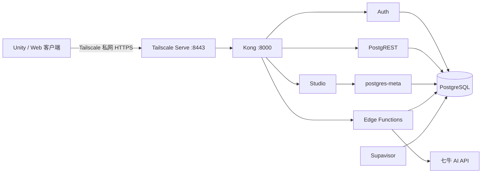

# Supabase 自托管搭建与 Unity 接入实战

> 适用项目：FragmentArticle
>
> 读者：主要做 Unity/C# 客户端，对 Linux、Docker、数据库和后端了解较少的开发者
>
> 最后远端复核日期：2026-07-18
>
> 当前阶段：单人私网开发环境，不是公网生产环境

## 1. 先建立整体认识

### 1.1 Supabase 到底是什么

可以把 Supabase 理解成一套围绕 PostgreSQL 数据库组装好的后端平台。它不是单个程序，而是一组互相协作的服务：

- PostgreSQL 保存用户、文章、卡片、进度等数据；
- Auth 负责注册、登录、刷新令牌和退出；
- PostgREST 把数据库表自动变成 HTTP API；
- Row Level Security，简称 RLS，在数据库内部限制“哪个用户能访问哪一行”；
- Edge Functions 承担普通数据库 API 不适合做的服务端逻辑；
- Kong 把多个服务统一到同一个 URL 下；
- Studio 提供可视化管理界面；
- Supavisor 管理 PostgreSQL 连接。

对 Unity 客户端来说，最终只是在访问 HTTP API：

- `/auth/v1/*`：注册、登录和会话；
- `/rest/v1/*`：读写数据库表；
- `/functions/v1/*`：调用自定义服务端函数。

Unity 不应该直接连接 PostgreSQL，也不需要知道每个 Docker 容器的地址。

### 1.2 本项目的完整请求链路



当前真实私网入口是：

```text
https://racknerd-b4acd93.tail635b33.ts.net:8443
```

这个地址只有加入同一 Tailscale 网络的设备才能访问。VPS 公网 IP 上没有暴露 Supabase 的原始端口。

### 1.3 为什么先做私网而不是直接公网

私网阶段适合单人开发：

- 不需要立刻购买和配置域名；
- 不需要开放 Kong、PostgreSQL 或 Studio 到互联网；
- 暂时没有 SMTP、限流、监控和公网攻击面的压力；
- 可以先验证 Auth、RLS、数据持久化和 Functions；
- 后续换正式域名只改 URL、回调白名单和反向代理，不迁移数据库。

这不等于“已经达到生产安全”。正式公开前仍要完成 SSH 加固、SMTP、限额、审计、备份恢复演练、域名和 Caddy 等工作。

## 2. 当前采用的架构和取舍

### 2.1 启动的 8 个服务

| 服务 | 作用 | Unity 是否直接访问 |
| --- | --- | --- |
| `db` | PostgreSQL，保存 Auth 和业务数据 | 否 |
| `auth` | 邮箱注册、密码登录、令牌刷新 | 通过 Kong |
| `rest` | PostgREST，提供表级 REST API | 通过 Kong |
| `meta` | Studio 查询数据库结构的辅助服务 | 否 |
| `studio` | 可视化后台 | 只由开发者访问 |
| `kong` | API 统一入口 | 是，间接访问所有 API |
| `functions` | 网页提取和 AI 代理 | 通过 Kong |
| `supavisor` | 数据库连接池 | Unity 不访问 |

### 2.2 暂时关闭的服务

- Realtime：当前产品没有订阅实时数据库变化；
- Storage：当前不上传原始 PDF；
- imgproxy：Storage 关闭后不需要图片变换服务；
- Analytics 和 Vector 日志栈：6 GB VPS 没必要承担额外内存；
- pgvector/RAG：现阶段没有明确的检索需求。

提取后的正文直接保存到 PostgreSQL 的 `articles.original_content`。原始 PDF 留在用户设备，不上传 VPS。

### 2.3 端口设计

| 宿主机端口 | 服务 | 监听地址 | 含义 |
| --- | --- | --- | --- |
| `8000` | Kong | `127.0.0.1` | 只能从 VPS 本机访问 |
| `5432` | Supavisor session/direct path | `127.0.0.1` | 迁移和管理使用 |
| `6543` | Supavisor transaction pool | `127.0.0.1` | 连接池事务模式 |
| `8443` | Tailscale Serve | Tailscale 私网 | Unity/Web 使用的 HTTPS 入口 |
| `443` | SSH | 当前仍在公网 | 开发期临时保留，发布前必须调整 |

不要把 `0.0.0.0:8000` 或 `0.0.0.0:5432` 暴露出去。Docker 发布端口可能绕过普通 UFW 规则，所以这里从 Compose 层直接绑定 `127.0.0.1`。

## 3. 目录与文件分别属于谁

### 3.1 Mac 上的应用仓库

```text
fragmentArticle/
├── infra/supabase/
│   ├── VERSION
│   ├── docker-compose.private.yml
│   ├── .env.private.example
│   └── com.fragmentarticle.supabase-backup.plist.example
├── scripts/supabase/
│   ├── bootstrap-host.sh
│   ├── sync-project.sh
│   ├── start-private.sh
│   ├── apply-migrations.sh
│   ├── verify-private.sh
│   └── backup-private.sh
└── supabase/
    ├── migrations/
    ├── tests/rls_isolation.sql
    └── functions/
```

这些是“我们维护的部署层”。它们应该进入 Git，并通过提交版本追踪。

### 3.2 VPS 上的目录

```text
/opt/fragment-article/
├── app/                         # 本项目的已提交 revision
└── supabase/                    # 官方 Supabase 仓库
    ├── docker/
    │   ├── docker-compose.yml   # 官方 Compose，不直接魔改
    │   ├── docker-compose.private.yml
    │   ├── .env                 # 真正密钥，只在服务器
    │   └── volumes/functions/   # 实际运行的 Functions
    └── project/
        ├── REVISION             # 同步了哪个应用提交
        └── supabase/
            ├── migrations/
            └── tests/
```

官方仓库固定在 `self-hosted/v0.7.0`。我们用额外的 Compose 覆盖文件改变端口、日志和 Functions 环境变量，而不是直接修改官方 `docker-compose.yml`。这样升级和排错时能区分“官方内容”和“项目定制”。

## 4. 密钥和环境变量：最容易出事故的一章

### 4.1 三类凭据

| 凭据 | 放在哪里 | 能否进入 Unity 包体 |
| --- | --- | --- |
| `ANON_KEY` / publishable key | Unity/Web 公共配置 | 可以，但必须有 RLS |
| 用户 `access_token` / `refresh_token` | 登录会话 | 运行时持有，需安全保存 |
| `SERVICE_ROLE_KEY` | 可信服务器 | 绝对不可以 |
| `POSTGRES_PASSWORD` | VPS `docker/.env` | 绝对不可以 |
| JWT 签名密钥 | VPS `docker/.env` | 绝对不可以 |
| `QINIU_API_KEY` | VPS `docker/.env` / Functions | 绝对不可以 |
| VPS root 密码/SSH 私钥 | 运维端 | 绝对不可以 |

`ANON_KEY` 名字容易让人误会。它不是“数据库密码”，而是告诉 Supabase“这是一个公开客户端”。真正的数据权限由用户 JWT 和 RLS 决定。因此 anon key 泄露不等于数据库失守，但如果 RLS 写错，anon key 就会放大问题。

### 4.2 官方 `.env` 不能被示例文件覆盖

`infra/supabase/.env.private.example` 只是非秘密配置清单。真正的 `docker/.env` 必须先由官方脚本生成：

- PostgreSQL 密码；
- JWT secret；
- anon key；
- service-role key；
- Dashboard 用户名和密码；
- Pooler tenant ID 等。

`bootstrap-host.sh` 会在首次初始化时调用官方密钥生成脚本，然后把私网阶段的非秘密开关合并进去。不要执行类似下面的危险操作：

```bash
# 错误：会用示例内容覆盖真实密钥
cp infra/supabase/.env.private.example /opt/fragment-article/supabase/docker/.env
```

### 4.3 当前重要 URL 配置

服务器当前配置为：

```dotenv
SUPABASE_PUBLIC_URL=https://racknerd-b4acd93.tail635b33.ts.net:8443
API_EXTERNAL_URL=https://racknerd-b4acd93.tail635b33.ts.net:8443/auth/v1
SITE_URL=http://localhost:5181
ADDITIONAL_REDIRECT_URLS=http://localhost:5174/**,http://localhost:5181/**
```

含义：

- `SUPABASE_PUBLIC_URL`：Studio 和服务对外认知的 API 根地址；
- `API_EXTERNAL_URL`：Auth 生成回调链接时使用的公开地址，必须带 `/auth/v1`；
- `SITE_URL`：Auth 默认回跳的客户端地址；
- `ADDITIONAL_REDIRECT_URLS`：允许的额外回调白名单。

换正式域名时必须同时修改这些值和 Unity/Web 配置，否则常见现象是“注册成功但回调去了旧地址”。

当前 Web 开发服务器还设置了：

```dotenv
VITE_SUPABASE_BROWSER_URL=/supabase-proxy
```

Vite 把这个同源路径代理到 tailnet HTTPS `:8443`，减少浏览器开发环境中的跨域和证书干扰。它只属于 Web/Vite 开发链路；Unity 直接访问 `https://racknerd-b4acd93.tail635b33.ts.net:8443`，不使用 Vite 代理。

## 5. 从一台空 Ubuntu VPS 开始

### 5.1 准备条件

- Ubuntu 24.04 LTS x86_64；
- 至少 4 GB RAM，当前为约 6 GB；
- 至少 40 GB 磁盘，当前系统盘约 95 GB；
- 可以使用 SSH 登录；
- Mac 和 VPS 都能访问互联网；
- Mac 已安装 Tailscale。

### 5.2 配置 SSH 公钥

Mac 生成密钥。如果已经存在 `~/.ssh/id_ed25519`，不要覆盖：

```bash
test -f ~/.ssh/id_ed25519 || ssh-keygen -t ed25519 -C "fragment-article-racknerd"
```

把公钥安装到 VPS：

```bash
ssh-copy-id -i ~/.ssh/id_ed25519.pub -p 443 root@107.175.95.166
```

验证无密码登录：

```bash
ssh -i ~/.ssh/id_ed25519 -p 443 -o BatchMode=yes root@107.175.95.166
```

`BatchMode=yes` 的意义是：密钥失败时立即报错，不偷偷等待密码输入。这对自动备份很重要。

### 5.3 记录服务器基线

登录 VPS 后执行：

```bash
nproc
free -h
df -h /
timedatectl status
ss -lntp
ufw status
```

你需要知道：CPU/内存是否够、磁盘是否快满、时间是否同步、哪些端口已经被占用。Supabase Auth 的 JWT 和证书都依赖正确时间。

### 5.4 建议增加 Swap

6 GB 内存可以运行裁剪后的栈，但镜像启动和构建会出现瞬时峰值。当前 VPS 配置了 3 GB swap。新机器可按实际情况配置，先检查：

```bash
swapon --show
free -h
```

不要机械重复创建 swapfile；只有确认当前没有合适 Swap 时再配置。

## 6. 建立 Tailscale 私网

### 6.1 为什么需要 Tailscale

Tailscale 会在设备之间建立加密网络。VPS 的 Tailscale IP 是 `100.84.96.100`，Mac mini 也有自己的 `100.x` 地址。公网扫描者无法通过这个网络访问 Supabase。

### 6.2 VPS 安装并登录

VPS 是 Ubuntu 24.04，对应发行版代号 `noble`。使用 Tailscale 官方 APT 仓库：

```bash
curl -fsSL \
  https://pkgs.tailscale.com/stable/ubuntu/noble.noarmor.gpg \
  -o /usr/share/keyrings/tailscale-archive-keyring.gpg

curl -fsSL \
  https://pkgs.tailscale.com/stable/ubuntu/noble.tailscale-keyring.list \
  -o /etc/apt/sources.list.d/tailscale.list

apt-get update
apt-get install -y tailscale
systemctl enable --now tailscaled
```

再启动并启用 Tailscale SSH：

```bash
tailscale up --ssh
```

命令会给出一次性浏览器 URL。用和 Mac 相同的 Tailscale 账号授权服务器。验证：

```bash
tailscale status
tailscale ip -4
```

应看到 Mac 与 `racknerd-b4acd93` 都在线。

### 6.3 使用 Tailscale Serve 暴露 Kong

Kong 只监听 VPS 的 `127.0.0.1:8000`，其他设备不能直接访问。Tailscale Serve 负责把私网 HTTPS 转发到这个回环地址：

```bash
tailscale serve --https=8443 --bg http://127.0.0.1:8000
tailscale serve status
```

当前输出应包含：

```text
https://racknerd-b4acd93.tail635b33.ts.net:8443 (tailnet only)
|-- / proxy http://127.0.0.1:8000
```

首次运行可能要求在 Tailscale 网页启用 Serve。`tailnet only` 表示它没有通过 Funnel 暴露到公网。

Mac 侧可以先做不带 key 的连通性粗检：

```bash
curl -sS -o /dev/null \
  -w 'status=%{http_code} verify=%{ssl_verify_result}\n' \
  https://racknerd-b4acd93.tail635b33.ts.net:8443/auth/v1/health
```

此时 `401` 只能证明 HTTPS、DNS、Tailscale 和 Kong 基本可达，不能证明 Auth 配置健康。`ssl_verify_result=0` 表示证书验证成功。正式健康检查必须带 anon key 并成功返回，以第 14.1 节的 `verify-private.sh` 为准。不要通过关闭 Unity 证书校验来“修复”网络问题。

### 6.4 访问 Studio

加入同一 tailnet 的开发设备可以在浏览器打开：

```text
https://racknerd-b4acd93.tail635b33.ts.net:8443
```

Studio 的 Dashboard 用户名和密码由官方初始化脚本生成，保存在 VPS 的 `docker/.env`。它们是管理凭据，不应进入 Unity、截图、Git 或聊天记录。Studio 适合查看表结构、少量数据和服务状态，不替代 migration；正式结构变更仍必须写 SQL migration。

### 6.5 临时连接数据库

Unity 永远不直接连接 PostgreSQL。开发者确实需要使用 `psql` 或数据库 GUI 时，优先建立 SSH 隧道：

```bash
ssh -i ~/.ssh/id_ed25519 \
  -p 443 \
  -N \
  -L 15432:127.0.0.1:5432 \
  root@107.175.95.166
```

然后数据库工具连接本机 `127.0.0.1:15432`。用户名、tenant ID 和密码从 VPS 受保护的 `.env` 获取，不要把它们写进 shell history。使用完毕按 `Ctrl+C` 关闭隧道。不要为了 GUI 方便把 `5432` 改成公网监听。

## 7. 安装 Docker 和固定版 Supabase

### 7.1 为什么不能直接 `docker compose up` 官方全栈

官方默认 Compose 包含本项目暂时不用的 Storage、Realtime、imgproxy 和日志服务，也可能发布更多宿主机端口。直接启动会增加内存、磁盘和攻击面。

本项目的 `bootstrap-host.sh` 会：

1. 验证系统是 Ubuntu；
2. 从 Docker 官方 APT 仓库安装 Docker Engine 和 Compose；
3. 克隆固定的 `self-hosted/v0.7.0`；
4. 生成官方密钥；
5. 安装私网 Compose 覆盖；
6. 检查当前 Compose 支持 `!override`；
7. 写入私网 Auth 和 Functions 默认配置。

### 7.2 同步应用仓库到 VPS

服务器需要一份已提交的应用 revision。可以使用 Git clone，也可以从可信开发机同步。当前服务器应用目录是：

```text
/opt/fragment-article/app
```

部署脚本只允许从已提交且部署相关目录干净的 revision 同步，避免把本机未完成修改悄悄推到服务器。

### 7.3 运行初始化脚本

在 VPS 的应用目录执行：

```bash
cd /opt/fragment-article/app
sudo scripts/supabase/bootstrap-host.sh /opt/fragment-article/supabase
```

检查版本：

```bash
docker --version
docker compose version
git -C /opt/fragment-article/supabase describe --tags --exact-match HEAD
```

最后一条必须是：

```text
self-hosted/v0.7.0
```

### 7.4 安装固定版 Supabase CLI

迁移脚本依赖 Supabase CLI。VPS 是 x86_64，因此安装官方 `linux_amd64` 制品，并先核对官方 checksum：

```bash
cd /tmp

curl -fLO \
  https://github.com/supabase/cli/releases/download/v2.72.7/supabase_linux_amd64.tar.gz
curl -fLO \
  https://github.com/supabase/cli/releases/download/v2.72.7/supabase_2.72.7_checksums.txt

grep 'supabase_linux_amd64.tar.gz$' \
  supabase_2.72.7_checksums.txt \
  | sha256sum -c -

tar -xzf supabase_linux_amd64.tar.gz
install -m 0755 supabase /usr/local/bin/supabase
supabase --version

rm -f supabase \
  supabase_linux_amd64.tar.gz \
  supabase_2.72.7_checksums.txt
```

版本必须输出 `2.72.7`。不要只下载可执行文件而跳过 checksum；固定版本和制品完整性都是可复现部署的一部分。

## 8. 配置 Auth 和 AI 服务端变量

### 8.1 私网 Auth 行为

当前阶段没有 SMTP，所以采用：

```dotenv
ENABLE_EMAIL_SIGNUP=true
ENABLE_EMAIL_AUTOCONFIRM=true
ENABLE_ANONYMOUS_USERS=false
ENABLE_PHONE_SIGNUP=false
```

邮箱自动确认意味着注册后直接获得 session。密码找回依赖邮件，因此私网阶段 UI 不应提供“忘记密码”。正式上线时要接入 SMTP、关闭自动确认并完整测试邮件回调。

### 8.2 配置低额度 AI Key

AI Key 只写入 VPS：

```dotenv
QINIU_API_KEY=<低额度开发 Key>
QINIU_API_ENDPOINT=https://api.qnaigc.com/v1
QINIU_MODEL=qwen/qwen3.7-plus
```

编辑时避免把整个 `.env` 打印到终端日志。可以使用权限为 `0600` 的编辑方式：

```bash
cd /opt/fragment-article/supabase/docker
chmod 600 .env
nano .env
```

在 SSH/root 加固完成前不要放正式高额度 Key，也不要导入真实用户数据。

### 8.3 `FUNCTIONS_VERIFY_JWT=false` 为什么不是安全漏洞

本项目有两类函数：

- `content-extractor` 允许访客提取公开网页；
- `openai-proxy` 会消耗付费 AI 配额，必须登录。

自托管 Edge Runtime 的全局 JWT 开关不能同时表达这两种规则，因此设为：

```dotenv
FUNCTIONS_VERIFY_JWT=false
```

这只是关闭 Functions 网关的统一 JWT 校验。`openai-proxy` 内部仍会提取 `Bearer` token，并调用 Supabase Auth 的 `getUser(token)` 验证真实用户。不要删除函数内部鉴权。

## 9. 同步项目制品并启动服务

### 9.1 同步迁移、测试和 Functions

```bash
cd /opt/fragment-article/app
scripts/supabase/sync-project.sh \
  /opt/fragment-article/app \
  /opt/fragment-article/supabase
```

脚本通过 `git archive HEAD` 只同步已提交内容，并明确排除 Functions 的 `.env` 文件。同步完成后检查：

```bash
cat /opt/fragment-article/supabase/project/REVISION
```

2026-07-18 远端复核时部署的 revision 是：

```text
6051cf43562b4bee293ac9a2bd7dda5e31c58dd3
```

### 9.2 只启动服务白名单

```bash
sudo /opt/fragment-article/app/scripts/supabase/start-private.sh \
  /opt/fragment-article/supabase
```

脚本显式启动：

```text
db auth rest meta studio kong functions supavisor
```

并删除先前误启动的 Realtime、Storage、imgproxy、Analytics 和 Vector 容器。

### 9.3 查看容器状态

```bash
cd /opt/fragment-article/supabase/docker
docker compose \
  --env-file .env \
  -f docker-compose.yml \
  -f docker-compose.private.yml \
  ps
```

8 个服务都应为 `running` 和 `healthy`。查看单个服务日志时要限制行数：

```bash
docker logs --tail 100 supabase-auth
docker logs --tail 100 supabase-edge-functions
```

不要把完整 `.env`、JWT 或用户正文贴进公开 issue。

## 10. 数据库迁移：把 Git 中的结构变成真实数据库

### 10.1 什么是 migration

Migration 是带时间戳的 SQL 变更记录。它类似 Unity 项目的版本化场景升级脚本：每个文件只描述一次结构变化，所有环境按相同顺序执行。

本项目共有 19 个迁移，建立的主要业务表包括：

- `subjects`：科目；
- `articles`：资料元数据和提取正文；
- `tags`、`article_tags`：标签体系；
- `cards`：碎片化学习卡片；
- `learning_progress`、`rewards`：学习进度和奖励；
- `dialogue_messages`、`dialogue_qa`：群聊学习；
- `galgame_messages`：Galgame 学习；
- `quiz_questions`：测验；
- `bookmarks`、`highlights`、`card_notes`：书签、标注、笔记；
- `article_text_annotations`、`article_text_qa`：原文标注和问答；
- `ai_conversations`：卡片问答记录。

### 10.2 执行迁移

VPS 安装了固定的 Supabase CLI `2.72.7`。执行：

```bash
sudo /opt/fragment-article/app/scripts/supabase/apply-migrations.sh \
  /opt/fragment-article/supabase/project \
  /opt/fragment-article/supabase
```

脚本内部使用：

```text
supabase db push --include-all
supabase db lint
```

不要用 `for file in migrations/*.sql; do psql -f ...` 代替，因为那样容易漏掉迁移历史，之后无法判断数据库处于哪个版本。

### 10.3 CLI 2.72.7 的本地无 TLS 兼容处理

这个版本在直接 `--db-url` 路径会丢弃 `sslmode=disable`，然后拒绝回落到明文连接。脚本创建临时标准 Supabase 工作目录，把本地 DB 端口设为当前回环 Supavisor 端口，从而走 CLI 明确的本地无 TLS 分支。

这是针对固定 CLI 版本的兼容措施。升级 Supabase CLI 时必须重新验证，不能永久假设仍需要它。

### 10.4 警告：历史迁移不能在生产库手工重放

`20260118155917_add_user_authentication.sql` 包含 `TRUNCATE`。本次是全新空数据库，所以没有旧数据损失。数据库开始承载真实数据后，绝不能手工重放历史迁移；新需求必须新增一个后续 migration。

## 11. RLS：客户端安全的真正边界

### 11.1 为什么 Unity 里有 anon key 仍然安全

Unity 请求会带：

```http
apikey: <ANON_KEY>
Authorization: Bearer <USER_ACCESS_TOKEN>
```

PostgREST 根据用户 JWT 设置 `auth.uid()`。RLS 在每次 SQL 查询时判断当前用户是否拥有目标行。即使攻击者反编译 Unity 包拿到 anon key，也不能绕过数据库策略读取其他用户的数据。

### 11.2 本项目的所有权链

顶层记录直接属于用户：

```text
auth.users.id -> articles.user_id
auth.users.id -> subjects.user_id
auth.users.id -> tags.user_id
```

子记录通过父对象验证所有权：

```text
user -> article -> card -> bookmark/highlight/note/conversation
user -> article -> dialogue/galgame/quiz/progress
```

因此插入一张卡片时，不需要让客户端提交 `user_id`，数据库会检查它引用的 `article_id` 是否属于当前用户。

### 11.3 最终硬化迁移的重要性

一些早期建表迁移为了快速开发曾创建宽松 anon 策略。最终迁移 `20260715090000_harden_authenticated_persistence.sql` 会删除旧策略并建立 authenticated、owner-scoped 策略。

只看最早的建表文件会得到错误结论。数据库安全状态由“全部迁移执行完成后的最终结果”决定。

### 11.4 运行双用户隔离测试

`supabase/tests/rls_isolation.sql` 在一个事务中创建用户 A 和用户 B，验证：

1. B 读不到 A 的文章；
2. B 改不了 A 的文章；
3. B 删不了 A 的文章；
4. B 不能伪造 A 的 `user_id`；
5. A 能读取自己的 Galgame 消息；
6. anon 不能读取 Galgame 消息。

测试最后 `ROLLBACK`，不会保留测试用户和数据。RLS 不是“看 SQL 感觉没问题”，而是必须用两个身份实际验证。

## 12. Edge Functions

### 12.1 `content-extractor`

Unity 或 Web 浏览器不能稳定直接抓取任意网页，常见原因是 CORS、登录墙和反爬。这个函数由 VPS 请求网页，再用 Readability 提取正文。

请求：

```http
POST /functions/v1/content-extractor
apikey: <ANON_KEY>
Content-Type: application/json

{"url":"https://developer.mozilla.org/en-US/docs/Web/HTTP"}
```

响应结构：

```json
{
  "title": "...",
  "content": "...",
  "byline": null,
  "sourceUrl": "https://..."
}
```

当前实现限制协议、初始私网主机名、重定向次数、响应类型、内容长度和 15 秒超时。公网发布前还需补全 DNS 解析后的 IPv4/IPv6/保留地址检查、DNS rebinding 防护和 IP 限流。

### 12.2 `openai-proxy`

AI Key 不能放在 Unity 包体，所以请求先到 Edge Function：

```http
POST /functions/v1/openai-proxy
apikey: <ANON_KEY>
Authorization: Bearer <USER_ACCESS_TOKEN>
Content-Type: application/json

{
  "model": "qwen/qwen3.7-plus",
  "messages": [{"role":"user","content":"把这段内容拆成卡片"}],
  "stream": false,
  "temperature": 0.7
}
```

函数执行顺序：

1. 严格解析 `Bearer` token；
2. 通过 Supabase Auth `getUser(token)` 验证用户；
3. 拒绝客户端提交 `apiKey` 或 `apiEndpoint`；
4. 校验模型白名单、消息数量、角色和 temperature；
5. 从服务器环境读取七牛 Key；
6. 转发到允许的 HTTPS 上游；
7. 过滤上游错误，避免泄露密钥。

未登录请求必须返回 `401`。不能仅靠 Unity UI 隐藏按钮，因为攻击者可以直接构造 HTTP 请求。

### 12.3 Functions 修改后的部署

先提交代码，再同步：

```bash
scripts/supabase/sync-project.sh \
  /opt/fragment-article/app \
  /opt/fragment-article/supabase
```

只重建 Functions：

```bash
cd /opt/fragment-article/supabase/docker
docker compose \
  --env-file .env \
  -f docker-compose.yml \
  -f docker-compose.private.yml \
  up -d --wait --force-recreate --no-deps functions
```

## 13. Unity 客户端如何接入

### 13.1 Unity 设备的网络前提

私网阶段，运行 Unity Editor 或测试包的设备必须加入同一 tailnet：

- macOS/Windows Editor：安装并登录 Tailscale；
- Android/iOS 真机：安装 Tailscale App，并登录同一账号；
- 未加入 tailnet 的普通用户设备无法访问这个 Supabase。

因此当前方案适合本人开发测试，不适合直接发布给大众。公开发布时要换正式域名和公网 HTTPS。

### 13.2 Unity 中允许出现的配置

```csharp
public static class BackendConfig
{
    public const string SupabaseUrl =
        "https://racknerd-b4acd93.tail635b33.ts.net:8443";

    // ANON_KEY 可以在客户端，但不能用 SERVICE_ROLE_KEY 替代。
    public const string AnonKey = "<SUPABASE_ANON_KEY>";
}
```

客户端配置被反编译是正常假设，所以安全性不能依赖“把字符串藏起来”。

### 13.3 一个不依赖 SDK 的 JSON 请求基础方法

Unity 原生 `UnityWebRequest` 能帮助理解真实协议。下面是最小构造方式；实际项目可以用协程、UniTask 或自己的请求调度器封装：

```csharp
using System.Text;
using UnityEngine.Networking;

public static class SupabaseRequest
{
    public static UnityWebRequest Create(
        string method,
        string path,
        string jsonBody = null,
        string accessToken = null)
    {
        var url = BackendConfig.SupabaseUrl.TrimEnd('/') + path;
        var request = new UnityWebRequest(url, method);
        request.downloadHandler = new DownloadHandlerBuffer();
        request.SetRequestHeader("apikey", BackendConfig.AnonKey);

        // GET/HEAD 传 null，不创建请求体；POST/PATCH/PUT 再传 JSON。
        if (jsonBody != null)
        {
            request.uploadHandler = new UploadHandlerRaw(
                Encoding.UTF8.GetBytes(jsonBody));
            request.SetRequestHeader("Content-Type", "application/json");
        }

        if (!string.IsNullOrEmpty(accessToken))
            request.SetRequestHeader("Authorization", "Bearer " + accessToken);

        return request;
    }
}
```

生产代码还要统一处理超时、网络断开、HTTP 状态码、响应 JSON 和请求取消。

### 13.4 注册

私网阶段邮箱自动确认，注册成功通常直接返回 session：

```http
POST /auth/v1/signup
apikey: <ANON_KEY>
Content-Type: application/json

{"email":"player@example.com","password":"至少足够强的密码"}
```

C# 请求：

```csharp
var body = JsonUtility.ToJson(new SignUpBody {
    email = email,
    password = password
});

using var request = SupabaseRequest.Create("POST", "/auth/v1/signup", body);
yield return request.SendWebRequest();
```

DTO：

```csharp
[System.Serializable]
public class SignUpBody
{
    public string email;
    public string password;
}
```

### 13.5 密码登录

```http
POST /auth/v1/token?grant_type=password
apikey: <ANON_KEY>
Content-Type: application/json

{"email":"player@example.com","password":"..."}
```

响应中最重要的是：

```json
{
  "access_token": "...",
  "refresh_token": "...",
  "expires_in": 3600,
  "token_type": "bearer",
  "user": { "id": "...", "email": "..." }
}
```

`access_token` 通常较短命，用于 API 请求；`refresh_token` 用于换新 token。不要把密码长期保存在 PlayerPrefs。

### 13.6 刷新会话

```http
POST /auth/v1/token?grant_type=refresh_token
apikey: <ANON_KEY>
Content-Type: application/json

{"refresh_token":"<REFRESH_TOKEN>"}
```

推荐会话策略：

1. 登录后保存 access token、refresh token 和过期时间；
2. API 请求前若快过期，先刷新；
3. 收到 `401` 时只自动刷新一次；
4. 刷新失败则清空本地会话并回到登录；
5. 多个并发请求只允许一个刷新任务，其他请求等待它。

开发阶段可以先用 PlayerPrefs 验证流程；正式移动端应使用 iOS Keychain、Android Keystore 或经过评审的安全存储方案保护 refresh token。

### 13.7 退出登录

```http
POST /auth/v1/logout
apikey: <ANON_KEY>
Authorization: Bearer <USER_ACCESS_TOKEN>
```

无论服务器请求是否成功，客户端都应清空本地 token 和当前用户缓存，避免把前一个账号的数据错误展示给下一个账号。

### 13.8 查询自己的文章

```http
GET /rest/v1/articles?select=*&order=created_at.desc
apikey: <ANON_KEY>
Authorization: Bearer <USER_ACCESS_TOKEN>
```

RLS 会自动把结果限制为当前用户的数据。不要把客户端传入的 `user_id` 当作安全条件。

C#：

```csharp
using var request = SupabaseRequest.Create(
    "GET",
    "/rest/v1/articles?select=*&order=created_at.desc",
    jsonBody: null,
    accessToken: session.access_token);

yield return request.SendWebRequest();
```

PostgREST 返回顶层 JSON 数组，而 Unity `JsonUtility` 不擅长解析顶层数组。可以选择：

- 项目已使用 Newtonsoft Json.NET 时直接反序列化；
- 写一个数组包装器；
- 使用经过 Unity/AOT 验证的 Supabase C# 社区 SDK。

### 13.9 创建文章

```http
POST /rest/v1/articles
apikey: <ANON_KEY>
Authorization: Bearer <USER_ACCESS_TOKEN>
Content-Type: application/json
Prefer: return=representation

{
  "title": "HTTP 学习资料",
  "original_content": "提取后的正文",
  "mode": "source"
}
```

不要在客户端提交 `user_id`。数据库会用 `auth.uid()` 填充并通过 RLS 校验归属。

### 13.10 调用网页提取

```csharp
[System.Serializable]
public class ExtractBody { public string url; }

var body = JsonUtility.ToJson(new ExtractBody { url = articleUrl });
using var request = SupabaseRequest.Create(
    "POST",
    "/functions/v1/content-extractor",
    body);
yield return request.SendWebRequest();
```

该函数当前允许访客，所以不需要用户 token，但仍需 `apikey` 通过 Kong 路由。

### 13.11 调用 AI 代理

```csharp
using var request = SupabaseRequest.Create(
    "POST",
    "/functions/v1/openai-proxy",
    aiRequestJson,
    session.access_token);
yield return request.SendWebRequest();
```

这里的 `Authorization` 必须是用户 access token，不是 anon key。请求体绝不能包含七牛 API Key 或任意上游 URL。

流式 SSE 在 Unity 中需要自定义 `DownloadHandlerScript` 增量处理字节和跨 chunk 的 UTF-8/SSE 行。建议先把 `stream=false` 的登录、错误处理和卡片生成跑通，再实现流式渲染，避免同时调试网络、解析和 UI。

### 13.12 使用 C# SDK 还是直接 REST

两种方式都可以：

| 方案 | 优点 | 风险/成本 |
| --- | --- | --- |
| `UnityWebRequest` 直连 REST | 协议透明、依赖少、AOT 行为可控 | 自己写 session、JSON 和错误处理 |
| Supabase 社区 C# SDK | Auth、查询构造更方便 | 需要验证 Unity 版本、IL2CPP、平台裁剪和包版本 |

建议学习阶段先完成一个原生 HTTP 垂直流程：注册 -> 登录 -> 创建文章 -> 查询文章 -> 刷新 token。理解协议后再决定是否引入 SDK。

## 14. 验证整套部署

### 14.1 服务器私网验证脚本

```bash
sudo /opt/fragment-article/app/scripts/supabase/verify-private.sh \
  /opt/fragment-article/supabase \
  107.175.95.166
```

它验证：

- 8 个批准容器全部健康；
- 5 个禁用服务没有残留容器；
- `8000/5432/6543` 只监听 `127.0.0.1`；
- VPS 公网 IP 无法连接上述端口；
- 带 anon key 的 Auth health 能通过 Kong。

### 14.2 Functions 验收

已经验证的真实结果：

```text
openai anonymous status=401 response_bytes=49
extractor status=200 response_bytes=9288
```

这证明匿名 AI 被拒绝，公网 MDN 页面能通过 VPS Functions 提取正文。

已用 `.env` 中已有开发 Key 验证：匿名请求返回 `401`，登录用户能完成一次非流式卡片生成和一次 SSE 流式生成；无效模型、客户端提交 `apiKey`/`apiEndpoint` 返回 `400`，日志没有 Key、JWT 或正文。

### 14.3 客户端端到端清单

- 注册后自动确认并获得 session；
- 登录、重启客户端、恢复 session、退出均正常；
- 访客数据只在本地，重启或登录后丢弃；
- 登录用户的科目、文章、卡片、群聊、Galgame、测验和进度持久化；
- 未登录 AI 返回 `401` 或明确登录提示；
- 登录后 AI 生成成功，且流式输出完成；
- 网页提取优先走 VPS Function，失败时降级 Jina 并显示提示；
- 掘金文章图片以真实 `` 渲染，不出现图片占位 token；
- 原始 PDF 没有上传；
- 用户 B 无法读取用户 A 的数据。

## 15. 加密备份和恢复

### 15.1 为什么不能把 VPS 自己当备份

数据库和未来可能启用的 Storage 都在同一 VPS 时，磁盘损坏、误删或账号问题会同时影响它们。备份必须离开 VPS。

当前策略是 Mac mini 主动拉取：

- VPS 不持有登录 Mac 的私钥；
- `pg_dump -Fc` 通过 SSH 流输出；
- 数据到达 Mac 时立即用 `age` 加密；
- 正常备份生成流程中，明文 dump 不落盘；
- 同时备份 Compose 配置和 PostgreSQL 自定义配置；
- 保留 14 日、8 周、6 月快照。

### 15.2 安装 age 并生成密钥

Mac 已安装 `age 1.3.1`。当前身份文件位于 `~/.config/fragment-article/backup-age-key.txt`，权限为 `0600`。在新机器重建时，使用权限受控的目录生成：

```bash
mkdir -p ~/.config/fragment-article
chmod 700 ~/.config/fragment-article
age-keygen -o ~/.config/fragment-article/backup-age-key.txt
chmod 600 ~/.config/fragment-article/backup-age-key.txt
```

命令会输出形如 `age1...` 的公钥 recipient。私钥文件不能提交 Git，也不要复制到 VPS。

### 15.3 执行备份

公网切换后，Mac 通过 `fragmentarticle-backup` SSH alias，以
`fragmentops@107.175.95.166:2222` 密钥登录方式非交互连接 VPS。
Tailscale 仅保留为运维回滚入口，不再是定时备份的前置条件。先验证：

```bash
ssh fragmentarticle-backup true
```

再使用同一个 SSH alias 运行：

```bash
scripts/supabase/backup-private.sh \
  fragmentarticle-backup \
  'age1替换为公钥recipient' \
  "$HOME/Backups/fragment-article/supabase" \
  /opt/fragment-article/supabase
```

自动任务必须始终先验证 `BatchMode=yes` 能无交互连接。实际定时任务使用稳定脚本 `~/.local/bin/fragmentarticle-supabase-backup`，而不是依赖可能被删除的临时 Git worktree。

当前已加载的 LaunchAgent 是
`~/Library/LaunchAgents/com.fragmentarticle.supabase-backup.plist`，每天本机时间
`03:20` 运行，备份写入 `~/Backups/fragment-article/supabase`。
`~/.ssh/config` 中的 `fragmentarticle-backup` 应指向公网
`fragmentops@107.175.95.166:2222`，使用现有 ed25519 密钥和
`BatchMode=yes`。首次迁移必须手动触发 LaunchAgent，确认退出码为 `0`、
生成新的三文件快照，并通过 `pg_restore --list` 检查后，才能释放 SSH
`443`。

### 15.4 解密检查

下面的命令会为了人工检查和恢复演练，把明文 dump 临时写入 `/tmp`。这与“正常备份生成流程不落明文”不矛盾；演练结束必须立即删除临时文件，并确保 Mac 本身有磁盘加密和访问控制。

```bash
age -d \
  -i ~/.config/fragment-article/backup-age-key.txt \
  -o /tmp/fragment-article.dump \
  "$HOME/Backups/fragment-article/supabase/daily/<时间>/database.dump.age"
```

检查格式：

```bash
pg_restore --list /tmp/fragment-article.dump | head
rm -f /tmp/fragment-article.dump
```

### 15.5 真正的恢复演练

“文件存在”不代表可恢复。当前固定 Supabase 镜像中，完整恢复必须使用 `supabase_admin`；`postgres` 不是 superuser，恢复 `vault.secrets` 时会被拒绝。每月至少一次：

1. 创建隔离的临时 PostgreSQL 数据库；
2. 使用 `pg_restore` 恢复；
3. 检查 `auth.users`；
4. 检查业务表及行数；
5. 检查 `supabase_migrations.schema_migrations`；
6. 检查 ownership helper functions 和 RLS policies；
7. 运行双用户隔离测试；
8. 删除临时数据库和明文文件。

不要直接把演练 dump 恢复到正在运行的正式数据库。2026-07-18 的实测恢复验证了 2 个 Auth 用户、1 篇业务资料、19 条迁移记录、17 张启用 RLS 的 `public` 表和 `auth.uid()` 函数，随后删除了临时库。

## 16. 日常开发和升级流程

### 16.1 修改数据库结构

1. 新建一个更晚时间戳的 migration；
2. 不修改已经在服务器执行的历史文件；
3. 本地审查 SQL 和 RLS；
4. 提交 Git；
5. 同步 `sync-project.sh`；
6. 执行 `apply-migrations.sh`；
7. 运行 lint、RLS 测试和客户端回归。

### 16.2 修改 Edge Function

1. 修改 `supabase/functions/*`；
2. 为纯校验逻辑增加 Node 测试；
3. 提交 Git；
4. 同步项目；
5. 只重建 `functions`；
6. 验证匿名、登录、错误和流式路径。

### 16.3 升级 Supabase

不要直接 `git pull` 官方仓库然后重启。正确顺序：

1. 阅读目标 Supabase self-hosted release notes；
2. 完成加密备份和恢复验证；
3. 在独立环境测试新 release；
4. 检查 Compose 服务名、环境变量和镜像兼容性；
5. 检查 `!override` 和迁移 CLI 兼容逻辑；
6. 更新 `infra/supabase/VERSION`；
7. 重新运行所有基础设施、RLS 和客户端验收；
8. 才升级真实 VPS。

## 17. 常见问题排查

| 现象 | 优先检查 | 常见原因 |
| --- | --- | --- |
| Unity 访问超时 | 设备是否登录同一 Tailscale | 设备不在 tailnet，或 URL/端口错误 |
| `401` 且没有登录 | 是否带用户 access token | 把 anon key 当成用户 token |
| Auth health 返回 `401` | 是否带 `apikey` | Kong Auth 路由要求 anon key |
| REST 返回空数组 | 用户身份、RLS、数据 owner | 当前账号没有数据，或 token 未恢复 |
| REST 返回 `42501`/权限错误 | RLS 和父级所有权 | 客户端伪造 `user_id` 或引用别人的父记录 |
| 注册后无 session | `ENABLE_EMAIL_AUTOCONFIRM` | 自动确认未生效或 Auth 容器未重建 |
| 回调到错误端口 | `SITE_URL`/redirect list | 仍使用旧的 localhost 端口 |
| Functions 404 | 同步目录和容器挂载 | Function 未同步或容器未重建 |
| AI 返回 `401` | `Authorization` | 用户 token 缺失/过期 |
| AI 返回 `503` | `QINIU_API_KEY` | 服务端没有配置临时 Key |
| AI 返回 `502` | Functions 日志和上游状态 | 上游不可达、模型/额度问题 |
| 网页提取 `422` | 目标内容类型/登录墙 | 页面不是 HTML、反爬或正文不足 |
| `db push` 报 TLS 错误 | CLI 版本和脚本 | 绕过了 `apply-migrations.sh` 的 2.72.7 兼容路径 |
| 容器反复重启 | `docker logs --tail 100` | 密钥缺失、依赖未健康、内存不足 |
| 磁盘增长过快 | `docker system df`, `df -h` | 镜像、卷或日志；确认日志轮转覆盖生效 |
| 备份脚本卡住 | SSH `BatchMode` | 仍需要密码或端口配置错误 |

### 17.1 快速诊断命令

```bash
# 服务状态
cd /opt/fragment-article/supabase/docker
docker compose --env-file .env \
  -f docker-compose.yml \
  -f docker-compose.private.yml ps

# 端口监听
ss -lntp

# Tailscale 和 Serve
tailscale status
tailscale serve status

# 资源
free -h
df -h /
docker stats --no-stream

# 最近日志
docker logs --tail 100 supabase-kong
docker logs --tail 100 supabase-auth
docker logs --tail 100 supabase-edge-functions
```

## 18. React Native 公网 API

### 18.1 最小公网架构

本阶段没有正式 Web 前端。React Native 只需要一个稳定的 Supabase API 根地址：

```text
React Native
    |
    | HTTPS 443
    v
api.iamchatgpt.top
    |
    v
Caddy
    |
    | 仅批准路径
    v
127.0.0.1:8000 Kong
```

Caddy 只允许：

```text
/auth/v1/*
/rest/v1/*
/functions/v1/*
```

根路径、Studio、Meta、Storage、Realtime 和未知路径返回 `404`。Caddy 不启用站点访问日志，避免 Auth 查询参数中的一次性 code 被记录；服务错误通过 `journalctl -u caddy` 检查。

公网端口边界：

| 端口 | 用途 | 公网状态 |
| --- | --- | --- |
| `80` | ACME 与 HTTPS 跳转 | 开放 |
| `443` | Caddy HTTPS | 开放 |
| `2222` | 非 root SSH | 仅密钥 |
| `8000` | Kong 原始入口 | 回环 |
| `5432` | PostgreSQL/Supavisor | 回环 |
| `6543` | Supavisor transaction | 回环 |
| `8443` | Tailscale Serve | tailnet only |

### 18.2 React Native 配置

客户端使用：

```text
Supabase URL: https://api.iamchatgpt.top
Auth callback: fragmentarticle://auth/callback
```

React Native 工程必须在 iOS 和 Android 中注册同一个 `fragmentarticle` scheme，才能接收 OAuth 或密码重置回调。当前 React 仓库不包含 React Native 原生工程，因此服务器可以验证允许的 redirect URL，但最终 deep link 跳转仍需在 React Native 工程中验收。

2026-07-26 实测发现，VPS 本机和 Let's Encrypt 验证节点可以正常访问该
域名，但当前中国大陆网络会在请求到达 Caddy 前重置
`api.iamchatgpt.top` 的 HTTP Host 和 TLS SNI。原因高度集中在域名包含
`chatgpt`，不是 Caddy、证书或 UFW 故障。国内正式发布应更换不含敏感
关键词的中性域名；Cloudflare 仍需要客户端发送原域名 SNI，不能可靠规避。
当前 Mac 的 `.env.local` 继续使用 Tailscale URL，避免本地开发中断。

服务端配置：

```dotenv
SUPABASE_PUBLIC_URL=https://api.iamchatgpt.top
API_EXTERNAL_URL=https://api.iamchatgpt.top/auth/v1
SITE_URL=fragmentarticle://auth/callback
ADDITIONAL_REDIRECT_URLS=fragmentarticle://auth/callback,http://localhost:5174/**,http://localhost:5183/**,https://iamchatgpt.top/**,https://www.iamchatgpt.top/**
```

客户端只能持有 anon key。AI Key、service-role key、JWT secret 和数据库密码仍只存在 VPS。

### 18.3 SSH 迁移顺序

公网 SSH 到 Caddy 的迁移已按以下顺序完成；该顺序仍是重建服务器时的
操作基线：

1. 创建非 root `fragmentops` sudo 用户；
2. 暂时同时监听 `443` 和 `2222`；
3. 从 Mac 新建 `fragmentops@107.175.95.166:2222` 密钥连接；
4. 验证 `sudo -n true`；
5. 禁止密码和 keyboard-interactive 登录；
6. 公网 root 登录必须失败；
7. 自动备份迁移到 `fragmentops@107.175.95.166:2222`，并验证新快照；
8. 移除 SSH `22/443`；
9. 再让 Caddy 监听 `80/443`。

任何一步失败都不能提前释放 `443`。已经暴露过的 root recovery password 在公网和备份验收完成后轮换，新值只存入 macOS Keychain，不写入仓库或文档。

### 18.4 Auth 与网页提取

当前只供所有者本人使用：

1. 公网入口上线后创建或确认所有者账号；
2. 验证登录、session 恢复和退出；
3. 立即设置 `DISABLE_SIGNUP=true` 并重建 Auth；
4. 验证新注册被拒绝、已有所有者仍可登录。

`openai-proxy` 和 `content-extractor` 都要求真实用户 access token。客户端请求仍同时带 anon `apikey`，但 `Authorization` 必须是用户 token。访客网页导入可以降级到 Jina Reader，不能匿名调用 VPS 抓取服务。

面向外部用户开放前，必须补齐 SMTP、密码找回、AI 每用户日额度、调用审计和 `429`；Cloudflare 不能替代这些应用层限制。

### 18.5 部署和回滚

公网部署必须从干净、已提交的 revision 同步。仓库提供：

- `infra/supabase/Caddyfile.public`：公网路径 allowlist；
- `scripts/supabase/configure-public-url.sh`：原子更新 URL 并备份 `.env`；
- `scripts/supabase/verify-public.sh`：验证 DNS、TLS、匿名拒绝与端口边界。

若 Caddy、TLS 或 Supabase URL 切换失败：

1. 停止 Caddy；
2. 从 `backups/public-rollout` 恢复 `.env`；
3. 只重建 `auth`、`studio` 和 `functions`；
4. 继续使用 Tailscale `:8443`；
5. 保持 SSH `2222`，不要因为 Caddy 故障自动改回 `443`。

Cloudflare、删除 Tailscale、Storage、Realtime、原始 PDF 上传和 RAG 都是后续独立阶段。

## 19. 当前实际进度

截至 2026-07-26，已经完成并有实测证据的内容：

- 部署 revision 为 `539e23c209c5247c1870cbe6ea2ffea550b43d87`；
- 公网 SSH 只监听 `2222`，仅 `fragmentops` ed25519 公钥登录，root 和密码登录均被拒绝；
- root recovery password 已轮换，新值只存于 macOS Keychain 服务 `fragmentarticle-racknerd-root-recovery`；
- UFW 默认拒绝入站，仅放行公网 `80/443/2222` 和 Tailscale 回滚接口；
- VPS 和 Mac mini 加入同一 Tailscale 网络；
- Tailscale Serve 私网 HTTPS `:8443` 可达，证书验证通过；
- Caddy `2.11.4` 和 Let's Encrypt 证书生效，只允许 Auth、REST、Functions；
- Docker `29.6.2`、Compose `5.3.1`；
- Supabase CLI `2.72.7`；
- 官方 Supabase 固定为 `self-hosted/v0.7.0`；
- 8 个批准服务均为 healthy；
- Realtime、Storage、imgproxy、Analytics、Vector 未启动；
- Kong 和 Supavisor 原始端口只监听回环；
- 19 个 migration 已通过 CLI 执行并记录历史；
- `public` 和 `extensions` 的数据库 lint 通过；
- RLS 双用户测试 6/6 通过并回滚；
- 匿名 `openai-proxy` 和 `content-extractor` 均返回 `401`；
- 临时登录账号通过 VPS Function 完成 RLS REST、网页提取、非流式 AI 和 SSE `[DONE]`；无效模型和客户端提交 API Key 均返回 `400`，验收账号随后删除；
- 数据库只保留 1 个 owner，公开注册返回 `422`，Auth health 返回 `200`；
- 浏览器链接导入优先走 `content-extractor`，失败时才降级 Jina；掘金文章的 26 张图片均以真实 `` 渲染；
- 带文本层 PDF 和扫描 PDF 均完成浏览器提取/OCR，网络记录确认没有 PDF 上传请求；
- 注册自动确认、退出、重新登录、刷新恢复和登录用户资料持久化通过；
- 首页重载约 3.3 秒，个人页同步约 2.4 秒；
- 本地单元测试、typecheck、lint 无 error、生产 build 均通过；
- Mac 已安装 `age 1.3.1`，LaunchAgent 已迁到 `fragmentops:2222` 并再次成功；
- 最新快照 `20260725T161804Z` 包含三份 `0600` 密文，数据库密文流式解密后的 PostgreSQL 17.6 `pg_restore --list` 有 651 行；
- 临时恢复演练验证 2 个 Auth 用户、1 篇资料、19 条迁移和 17 张 RLS 表。

仍未进入当前开发阶段的内容：

- 不含敏感关键词的中性正式域名；
- SMTP、邮箱确认和密码找回；
- AI 每用户日额度、调用审计和 `429`；
- 网页提取的公网 IP 限流与完整 SSRF 回归；
- 正式平台 AI Key；
- Supabase Storage、RAG 和向量搜索。

## 20. 对外用户发布前的硬性门槛

1. 把 `api.iamchatgpt.top` 换成大陆网络可达的中性域名，并重跑公网验收；
2. 在 React Native 工程注册 `fragmentarticle` deep link 并完成真机回调；
3. 接入 SMTP，关闭邮箱自动确认，完成密码找回；
4. 增加 AI 每日额度、调用审计和滥用保护；
5. 完成网页提取的完整 SSRF 防护和 IP 限流；
6. 确认 Studio、PostgreSQL、Supavisor 仍只允许私网；
7. 确认最近一次加密备份和完整恢复演练仍通过；
8. 再部署正式 AI Key 和真实用户数据。

## 21. 命令速查

```bash
# SSH
ssh fragmentarticle-backup

# 等价的显式写法
ssh -i ~/.ssh/id_ed25519 -p 2222 fragmentops@107.175.95.166

# 初始化官方栈
sudo scripts/supabase/bootstrap-host.sh /opt/fragment-article/supabase

# 同步已提交的迁移/测试/Functions
scripts/supabase/sync-project.sh "$PWD" /opt/fragment-article/supabase

# 启动服务白名单
sudo scripts/supabase/start-private.sh /opt/fragment-article/supabase

# 迁移和 lint
sudo scripts/supabase/apply-migrations.sh \
  /opt/fragment-article/supabase/project \
  /opt/fragment-article/supabase

# 私网/容器/端口验证
sudo scripts/supabase/verify-private.sh \
  /opt/fragment-article/supabase \
  107.175.95.166

# 私网 HTTPS
tailscale serve --https=8443 --bg http://127.0.0.1:8000
tailscale serve status

# 服务状态
cd /opt/fragment-article/supabase/docker
docker compose --env-file .env \
  -f docker-compose.yml \
  -f docker-compose.private.yml ps
```

## 22. 术语表

| 术语 | 简单解释 |
| --- | --- |
| PostgreSQL | 真正保存数据的关系型数据库 |
| Schema | 数据库中的命名空间，如 `public`、`auth` |
| Migration | 可按顺序执行、进入 Git 的数据库变更 |
| PostgREST | 把 PostgreSQL 表和函数转换成 REST API |
| RLS | 数据库逐行授权规则 |
| JWT | 用户登录后携带身份声明的签名 token |
| Access token | 较短命的 API 身份令牌 |
| Refresh token | 用于换取新 access token 的较长期令牌 |
| anon key | 可以发布给客户端的 Supabase 项目公共 key |
| service-role key | 绕过 RLS 的服务端高权限 key，绝不能进客户端 |
| Kong | 统一 API 网关和路由层 |
| Supavisor | PostgreSQL 连接池 |
| Edge Function | 运行在服务端的自定义 TypeScript/Deno 函数 |
| Docker image | 程序及其运行环境的只读模板 |
| Docker container | image 的一个运行实例 |
| Docker volume | 独立于容器生命周期的持久化数据 |
| Compose | 用 YAML 编排多个 Docker 服务 |
| Tailscale | 基于 WireGuard 的设备私网 |
| Tailscale Serve | 把某个私网 HTTPS 地址代理到本机服务 |
| SSRF | 服务端被诱导请求内网/敏感地址的漏洞 |
| SMTP | 发送注册确认和密码重置邮件的服务 |
| RAG | 先检索相关资料，再让模型基于资料回答 |

## 23. 对应仓库资料

- `infra/supabase/README.md`：简版日常运维说明；
- `infra/supabase/docker-compose.private.yml`：私网端口和日志覆盖；
- `scripts/supabase/*.sh`：可复现的安装、同步、迁移、验证和备份脚本；
- `supabase/migrations/`：数据库演进历史；
- `supabase/tests/rls_isolation.sql`：双用户隔离测试；
- `supabase/functions/openai-proxy/`：登录后 AI 代理；
- `supabase/functions/content-extractor/`：公开网页正文提取；
- `Docs/superpowers/specs/2026-07-16-self-hosted-supabase-deployment-design.md`：架构决策；
- `Docs/superpowers/plans/2026-07-16-self-hosted-supabase-deployment.md`：实施步骤与验收标准。

官方参考：

- [Supabase Self-Hosting with Docker](https://supabase.com/docs/guides/self-hosting/docker)
- [Supabase Self-Hosted Auth Keys](https://supabase.com/docs/guides/self-hosting/self-hosted-auth-keys)
- [Supabase Edge Functions](https://supabase.com/docs/guides/functions)
- [Supabase CLI v2.72.7 Release](https://github.com/supabase/cli/releases/tag/v2.72.7)
- [Tailscale Serve](https://tailscale.com/kb/1242/tailscale-serve)
- [PostgreSQL Row Security Policies](https://www.postgresql.org/docs/current/ddl-rowsecurity.html)
